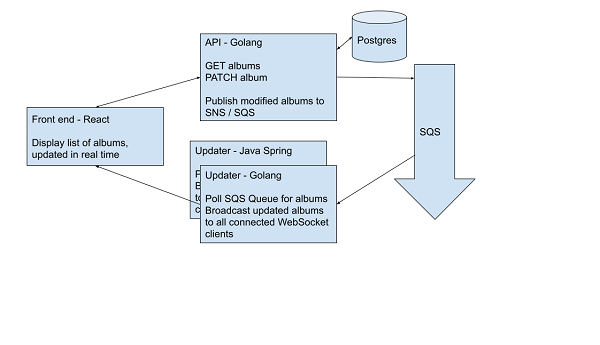

## Experiment 1 API
Go Implementation of RESTful API

With FX dependency injection

Publishes updated objects to SNS for downstream "Updater" Service

System Overview



## Example API requests to exercise the system
```
$ curl api-1-golang:8080/albums
$ curl -X PATCH api-1-golang:8080/albums/1 --data '{"id": 1, "price": 11.22}'
```